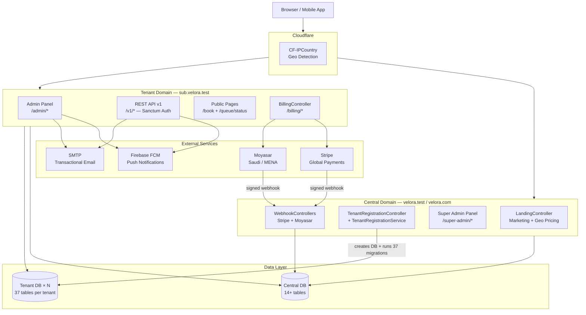
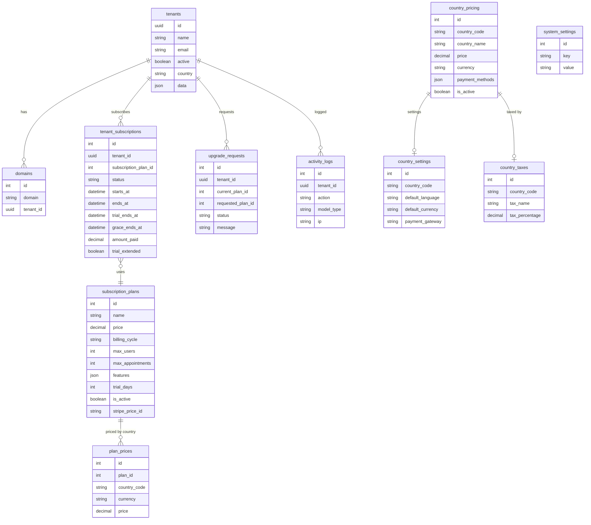
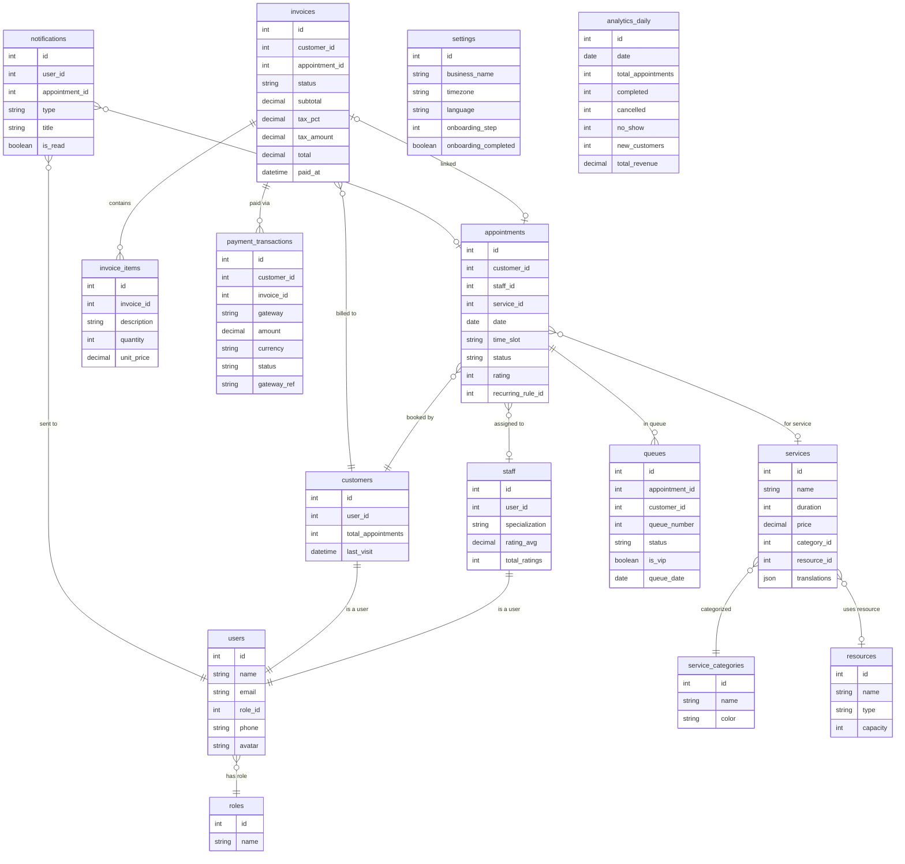
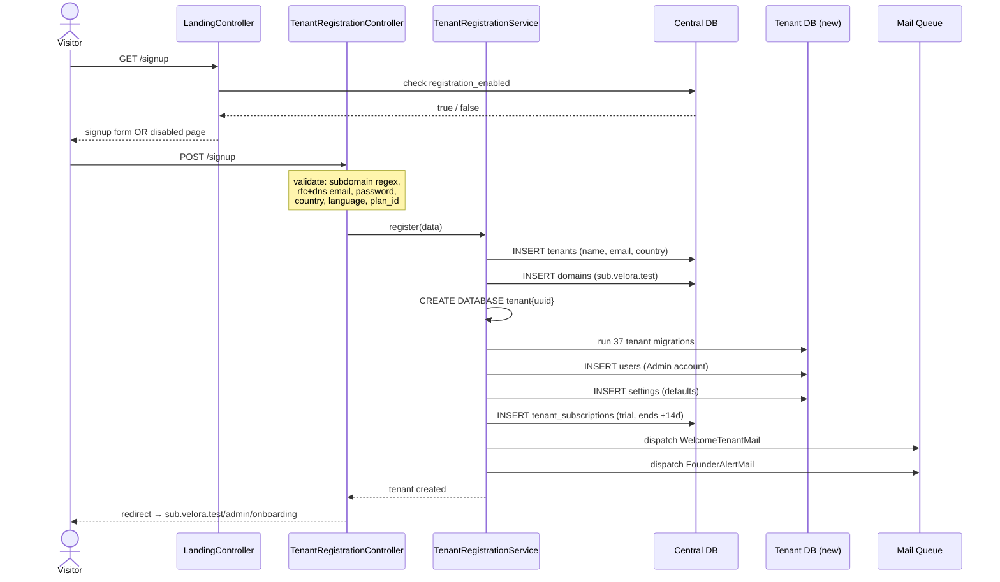
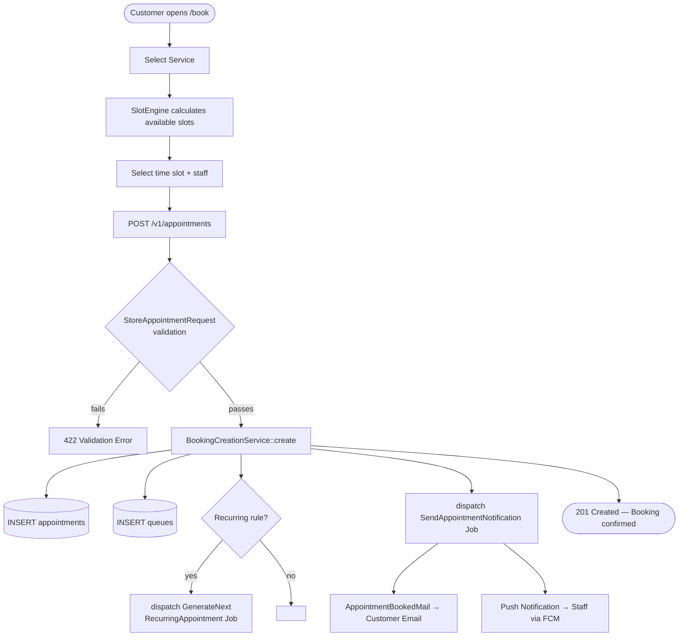
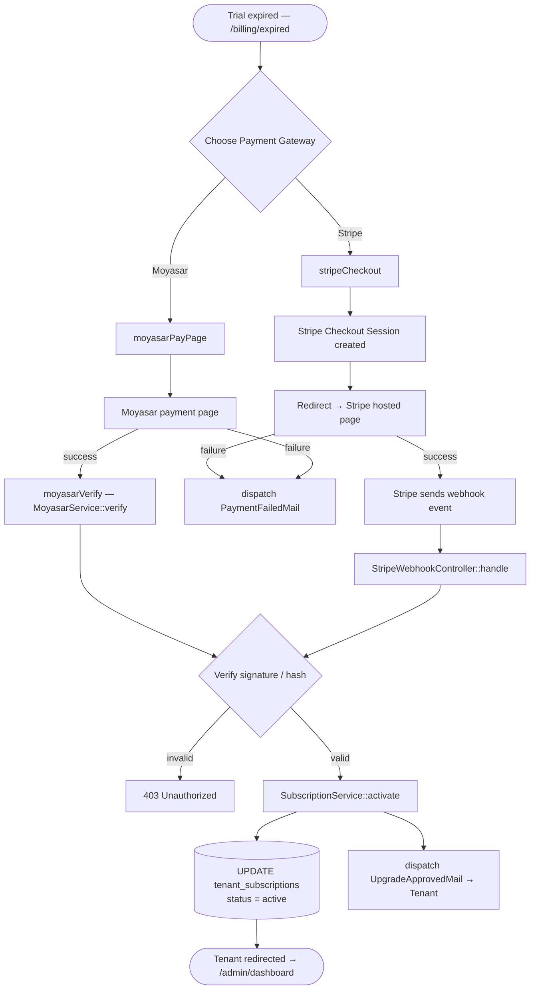
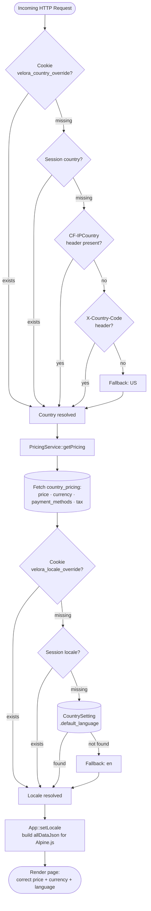

# تقرير شامل — منصة Velora
**الرابط:** http://velora.test/  
**تاريخ التقرير:** 8 مارس 2026  
**الإطار:** Laravel 12 · PHP 8.2+ · Multi-Tenant SaaS

---

## 1. نظرة عامة على المشروع

**Velora** منصة SaaS متعددة المستأجرين (Multi-tenant) لإدارة المواعيد والحجوزات والطوابير. مبنية بـ Laravel 12 مع عزل كامل لكل مستأجر (قاعدة بيانات منفصلة).

| النطاق | الغرض |
|--------|-------|
| `velora.test` / `velora.com` (Central Domain) | الصفحة التسويقية · التسجيل · لوحة Super Admin |
| `{subdomain}.velora.test` (Tenant Domain) | بوابة كل عمل تجاري — DB منعزلة بالكامل |

### 1.1 تدفق الاستخدام الكامل

```
زائر جديد → velora.test
     ↓
يرى صفحة تسويقية بسعر بلده + لغته (كشف IP تلقائي)
     ↓
يضغط "Start Free Trial" → /signup
     ↓
يملأ: اسم العمل + subdomain + إيميل + password
     ↓
TenantRegistrationService ينشئ:
  • سجل tenant في Central DB
  • domain مرتبط (subdomain.velora.test)
  • قاعدة بيانات جديدة (tenant{uuid})
  • migration كاملة للـ tenant DB
  • حساب Admin أول
  • اشتراك trial لـ 14 يوم
  • يرسل WelcomeTenantMail + FounderAlertMail
     ↓
يُعاد توجيهه تلقائياً → subdomain.velora.test/admin/onboarding
     ↓
معالج الإعداد الأولي (4 خطوات)
     ↓
يبدأ العمل: حجوزات / طابور / موظفين / تقارير
```

---

## 2. الصفحات والمسارات

### 2.1 المسارات المركزية — `routes/web.php`

| Method | المسار | Controller | الوصف |
|--------|--------|-----------|-------|
| GET | `/` | `LandingController@index` | الصفحة الرئيسية — كشف IP، تحميل التسعير، بناء `allDataJson` |
| GET | `/pricing` | `LandingController@pricing` | صفحة تسعير مفصلة (annual × 10 months) |
| POST | `/pricing/set-country` | `PricingController@setCountry` | ضبط الدولة (throttle: 30/دقيقة) |
| GET | `/signup` | `LandingController@signup` | عرض فورم التسجيل |
| GET | `/signup/check-subdomain` | `LandingController@checkSubdomain` | AJAX — فحص توفر الـ subdomain |
| POST | `/signup` | `TenantRegistrationController@store` | إنشاء tenant جديد (throttle: 10/دقيقة) |
| GET | `/login` | `LandingController@login` | صفحة البحث عن الحساب للدخول |
| GET | `/lang/{locale}` | `LandingController@switchLang` | تغيير اللغة (cookie دائم) |
| GET | `/region/{locale}/{country}` | `LandingController@switchRegion` | تغيير المنطقة + الدولة (cookie دائم) |
| GET | `/currency/{currency}` | `LandingController@switchCurrency` | تغيير العملة |
| POST | `/webhooks/stripe` | `StripeWebhookController@handle` | أحداث Stripe (بدون CSRF) |
| POST | `/webhooks/moyasar` | `MoyasarWebhookController@handle` | أحداث Moyasar (بدون CSRF) |

### 2.2 لوحة Super Admin — (middleware: `super.admin.auth`)

| المسار | Controller | الوصف |
|--------|-----------|-------|
| `/super-admin/login` | `SuperAdminAuthController` | تسجيل دخول المشرف العام |
| `/super-admin/dashboard` | `SuperAdmin\DashboardController` | إجمالي المستأجرين، المدفوعين، التجريبيين، رسم بياني آخر 30 يوم |
| `/super-admin/tenants` | `SuperAdmin\TenantController` | CRUD المستأجرين + تفعيل/تعطيل |
| `/super-admin/subscription-plans` | `SuperAdmin\SubscriptionPlanController` | CRUD الخطط + تفعيل/إيقاف |
| `/super-admin/activity-logs` | `SuperAdmin\ActivityLogController` | سجل النشاطات مع فلترة |
| `/super-admin/settings` | `SuperAdmin\SystemSettingController` | إعدادات النظام (trial_days، registration_enabled، ...) |
| `/super-admin/notifications` | `SuperAdmin\SystemNotificationController` | CRUD + إرسال إشعار لجميع المستأجرين |
| `/super-admin/reports` | `SuperAdmin\DashboardController@reports` | تقارير النمو والإيرادات |
| `/super-admin/kpis` | `SuperAdmin\DashboardController@kpis` | مؤشرات الأداء الرئيسية + تصدير CSV |
| `/super-admin/countries` | `CountrySettingController` | Resource CRUD الدول |
| `/super-admin/country-pricing` | `SuperAdmin\CountryPricingController` | CRUD التسعير الجغرافي + toggle active |
| `/super-admin/upgrade-requests` | (SuperAdmin) | قبول/رفض طلبات ترقية الخطة |

### 2.3 مسارات API — `routes/api.php`

**API المشرف العام** (prefix: `/super-admin`, auth: `web + super.admin`):

| الـ endpoint | الوصف |
|-------------|-------|
| `GET /super-admin/dashboard` | إحصاءات شاملة |
| `GET/POST/PUT/DELETE /super-admin/tenants` | إدارة المستأجرين |
| `GET/POST/PUT/DELETE /super-admin/subscription-plans` | إدارة الخطط + `PATCH toggle` |
| `GET /super-admin/activity-logs` | سجل مفلتر |
| `GET/PUT /super-admin/settings` | إعدادات النظام |
| `GET/POST/DELETE /super-admin/notifications` + `POST /send` | الإشعارات |

**API المستأجر — المصادقة** (prefix: `/auth` و `/v1/auth`):

| الـ endpoint | الوصف |
|-------------|-------|
| `POST /auth/login` | تسجيل الدخول → يعيد Sanctum token |
| `POST /auth/register` | تسجيل مستخدم جديد داخل tenant |
| `GET /auth/profile` | ملف المستخدم الحالي |
| `POST /auth/logout` | إلغاء الـ token الحالي |

**API المستأجر v1** (middleware: `tenant + auth:sanctum`):

| المورد | Method | الـ endpoint | الصلاحيات | الوصف |
|--------|--------|-------------|-----------|-------|
| المواعيد | GET/POST/PUT/DELETE | `/v1/appointments` | Admin+Staff | CRUD كامل |
| | PATCH | `/v1/appointments/{id}/quick-status` | Admin+Staff | تغيير الحالة سريعاً |
| | POST | `/v1/appointments/{id}/add-to-queue` | Admin+Staff | إضافة للطابور |
| | POST | `/v1/appointments/{id}/send-reminder` | Admin | إرسال تذكير يدوي |
| | GET | `/v1/appointments/{id}/qr` | Admin+Staff | QR code مشفّر |
| | POST | `/v1/appointments/{id}/rate` | Customer | تقييم الموعد |
| مواعيدي | GET | `/v1/my-appointments` | Customer | مواعيد العميل فقط |
| الطابور | GET | `/v1/queue` | Admin+Staff | الطابور الحالي |
| | POST | `/v1/queue/add` | Admin+Staff | إضافة للطابور |
| | POST | `/v1/queue/next` | Admin+Staff | استدعاء التالي |
| | POST | `/v1/queue/{id}/priority` | Admin | ترقية لـ VIP |
| | POST | `/v1/queue/{id}/skip` | Admin+Staff | تخطي |
| | GET | `/v1/queue/by-status` | Admin+Staff | فلترة بالحالة |
| الإشعارات | GET/DELETE | `/v1/notifications` | الكل | قائمة + حذف |
| | PATCH | `/v1/notifications/{id}/read` | الكل | تعليم كمقروء |
| | GET | `/v1/notifications/unread-count` | الكل | عدد غير مقروءة |
| الفواتير | GET/POST/PUT/DELETE | `/v1/invoices` | Admin+Customer | CRUD |
| | PATCH | `/v1/invoices/{id}/status` | Admin | تحديث الحالة |
| | GET | `/v1/invoices/{id}/items` | Admin | بنود الفاتورة |
| الإعدادات | GET/PUT | `/v1/settings` | Admin | إعدادات الـ tenant |
| التقارير | GET | `/v1/reports/dashboard` | Admin | لوحة إحصاءات |
| | GET | `/v1/reports/export` | Admin | تصدير PDF/CSV |
| التحليلات | GET | `/v1/analytics/summary` | Admin | KPIs لفترة محددة |
| | GET | `/v1/analytics/daily` | Admin | بيانات يومية تجميعية |
| Push Tokens | GET/POST/DELETE | `/v1/push-tokens` | الكل | إدارة رموز الأجهزة |

### 2.4 مسارات المستأجر — `routes/tenant.php`

**صفحات عامة (بدون Auth):**

| المسار | Controller | الوصف |
|--------|-----------|-------|
| `/book` | `Web\QueueController@book` | صفحة الحجز للعملاء (اختيار خدمة + وقت) |
| `/queue/status` | `Web\QueueController@status` | تتبع وضع الطابور العام |
| `/login` | `Auth\TenantAuthController@login` | تسجيل دخول داخل الـ subdomain |
| `/billing/expired` | `BillingController@expired` | صفحة انتهاء الاشتراك + خيارات التجديد |
| `/billing/moyasar/pay` | `BillingController@moyasarPay` | صفحة دفع Moyasar |

**لوحة الإدارة** (`/admin/*`, middleware: `auth + role + subscription + onboarding`):

| المسار | Controller | الوظيفة الرئيسية |
|--------|-----------|-----------------|
| `/admin/dashboard` | `Admin\DashboardController@index` | إحصاءات اليوم، أداء الموظفين، رسم بياني آخر 7 أيام، أعلى الخدمات |
| `/admin/appointments` | `Admin\AppointmentController` | عرض مجمّع بالتاريخ + فلترة + Paginate + تصدير |
| `/admin/queue` | `Admin\QueueController` | إدارة الطابور الحي (VIP، استدعاء، تخطي) |
| `/admin/staff` | `Admin\StaffController` | CRUD الموظفين + جداول العمل |
| `/admin/customers` | `Admin\CustomerController` | CRUD العملاء + GDPR tools |
| `/admin/reports` | `Admin\ReportController` | تقارير الأداء + تصدير Excel |
| `/admin/settings` | `Admin\SettingController` | إعدادات العمل (اسم، شعار، لغة، timezone) |
| `/admin/subscription` | `Web\SubscriptionController` | تفاصيل الخطة + طلب ترقية |
| `/admin/assistants` | `Web\AssistantController` | CRUD المساعدين + إرسال WelcomeAssistantMail |
| `/admin/onboarding` | `Admin\OnboardingController` | معالج 4 خطوات |
| `/admin/profile` | `Web\ProfileController` | تحديث البيانات الشخصية |

**AJAX الإدارة** (`/admin/api/*`):

| المسار | الوصف |
|--------|-------|
| `/admin/api/services` | CRUD الخدمات |
| `/admin/api/timeslots` | إدارة الأوقات المتاحة |
| `/admin/api/working-days` | تحديد أيام العمل |
| `/admin/api/staff` | إدارة الموظفين |
| `/admin/api/queue/*` | عمليات الطابور الحي |
| `/admin/api/customers` | v1 و v2 للعملاء |
| `/admin/api/commissions` | عمولات الموظفين |
| `/admin/api/payments` | إدارة المدفوعات |
| `/admin/api/assistants` | إدارة المساعدين |
| `/admin/api/holidays` | الإجازات |
| `/admin/api/service-categories` | تصنيفات الخدمات |
| `/admin/api/staff-schedule` | جداول الموظفين |
| `/admin/api/business-rules` | قواعد العمل |
| `/admin/api/gdpr` | أدوات GDPR |
| `/admin/api/analytics` | جلب بيانات التحليلات |
| `/admin/api/reminder-rules` | قواعد التذكيرات |
| `/admin/api/resources` | الموارد (غرف/أجهزة) |
| `/admin/api/recurring` | المواعيد المتكررة |
| `/admin/api/invoices` | الفواتير |
| `/admin/api/waiting-list` | قائمة الانتظار |

---

## 3. الصفحة الرئيسية — http://velora.test/

تمتد الصفحة من `resources/views/landing/index.blade.php` وتحتوي على الأقسام التالية **بالترتيب**:

### 3.1 الشريط الجغرافي (Geo Bar)
- شريط لاصق يظهر علم الدولة المكتشفة تلقائياً
- اسم الدولة + العملة + اللغة
- زر "Change region" يفتح Modal اختيار الدولة
- يستخدم IP detection عبر `GeoService` (Cloudflare CF-IPCountry header أولاً)

### 3.2 قسم Hero
- خلفية gradient داكنة مع تأثيرات
- عنوان رئيسي ضخم مع نص مميز (gradient text)
- شارة "Now with AI scheduling • :days-day free trial"
- زران: **ابدأ التجربة المجانية** + **شاهد كيف تعمل**
- 3 عناصر ثقة: "No credit card" · "Setup in 5 min" · "Cancel anytime"
- لقطة شاشة/mockup للمنصة

### 3.3 شريط الإحصاءات (Stats Ticker)
- متحرك/scrolling ticker
- أرقام: المواعيد، العملاء، الدول، وقت الإعداد

### 3.4 شعارات العملاء (Logos)
- صف من شعارات شركاء أو عملاء

### 3.5 قسم المميزات (`#features`)
- شبكة بطاقات تعرض 12 ميزة للمنصة:
  - إدارة المواعيد الذكية
  - الطابور الرقمي الفوري
  - حسابات موظفين غير محدودة
  - التقييمات والملاحظات
  - تحليلات وتقارير الأعمال
  - تذكيرات SMS وبريد إلكتروني تلقائية
  - 15 لغة للواجهة
  - معالج الإعداد
  - قاعدة بيانات معزولة لكل مستأجر
  - وصول API
  - صفحة حجز مخصصة
  - دعم ذو أولوية

### 3.6 قسم كيف تعمل (`#how-it-works`)
- 3 خطوات مع أسهم توصيل (RTL-aware):
  1. **إنشاء حسابك** — الإعداد الأولي
  2. **تخصيص الإعدادات** — الخدمات، الأوقات، الموظفين
  3. **ابدأ العمل** — افتح الحجز واستقبل العملاء
- زر CTA أسفل الخطوات

### 3.7 قسم التسعير (`#pricing`)
**البيانات تُجلب من `LandingController@index` وتُمرر لـ Alpine.js عبر `allDataJson`**

- **التبديل**: شهري / سنوي (وفّر شهرين — يُدفع 10 شهور بدل 12)
- **بطاقة التسعير** (ديناميكية بالكامل بـ Alpine.js):
  - اسم التطبيق + نوع الخطة
  - شارة "{days}-day free trial" (من `SystemSetting::get('default_trial_days')`)
  - السعر بالعملة المحلية (يتغير بـ Alpine.js فور تغيير الدولة)
  - عرض الفاتورة السنوية عند التبديل
  - علامة الضريبة (إذا كانت `taxPct > 0`) مع اسمها (VAT، GST، ...)
  - **زر CTA**: "Start :days-Day Free Trial" أو رسالة "التسجيل مغلق" (من `registration_enabled`)
  - "No credit card · Cancel anytime · No setup fees"
  - **طرق الدفع** (تتغير حسب الدولة من `payment_methods` في `country_pricing`)
  - تنبيه الضريبة عند الدفع
  - ضمان استرداد 30 يوم
  - زر تغيير المنطقة
- **قائمة المميزات** — 12 ميزة بـ check marks (مترجمة لـ 15 لغة)
- **جدول مراحل التجربة**:
  1. وصول كامل — الأيام 1–{days}
  2. فترة السماح (grace) — الأيام {days+1}–{days+3}
  3. وضع القراءة فقط — اليوم {days+4}+
- **إحصاءات**: عدد الشركات (من `tenants` table) · المواعيد · الدول

### 3.8 التوصيات (`#testimonials`)
- 6 بطاقات توصية من عملاء: Dubai, Madrid, Shanghai, Cairo, London, Berlin
- كل بطاقة: نجوم + اقتباس + اسم + صفة + علم الدولة

### 3.9 الأسئلة الشائعة (`#faq`)
- 8 أسئلة وأجوبة accordion بـ Alpine.js
- مترجمة بالكامل عبر `faq_1_q/a` ... `faq_8_q/a`

### 3.10 زر الدعوة الأخير (CTA)
- خلفية gradient radial مع تأثير glow أرجواني

### 3.11 Modal اختيار الدولة (Country Switcher)
- يفتح بـ Alpine.js عند الضغط على "Change region"
- حقل بحث بالدول
- شبكة 3 أعمدة من الدول (flag + اسم + لغة) — البيانات من `countriesWithPricing`
- زر "Other countries" → يختار GLOBAL pricing
- عند الاختيار: ينتقل إلى `/region/{locale}/{country}` → يضبط cookies دائمة

---

## 4. Controllers — التفصيل الكامل

### 4.1 Central Controllers

#### `LandingController`
| الدالة | الوصف |
|--------|-------|
| `index()` | يجلب التسعير الجغرافي، يبني `allDataJson` لـ Alpine.js، يحسب `taxPct`، يعيد `landing.index` |
| `signup()` | يتحقق من `registration_enabled`، يعرض `landing.signup` أو `landing.registration-disabled` |
| `pricing()` | صفحة تسعير منفصلة مع `annualMultiplier = 10` |
| `checkSubdomain()` | AJAX — يستدعي `TenantRegistrationService::checkSubdomainAvailability()` |
| `switchLang()` | يضبط cookie لغة دائم |
| `switchRegion()` | يضبط cookies `velora_locale_override` + `velora_country_override` |
| `getPlatformStats()` | يعد الـ tenants + الدول من `JSON_EXTRACT(data, '$.country')` |

#### `Auth\TenantRegistrationController`
| الدالة | الوصف |
|--------|-------|
| `store()` | يُعقِّم: business_name, subdomain (regex), email, password, country, language, terms, plan_id → يستدعي `TenantRegistrationService::register()` → يُعيد JSON أو redirect |

#### `BillingController`
| الدالة | الوصف |
|--------|-------|
| `expired()` | يجلب آخر اشتراك + الخطط المتاحة + الفواتير السابقة للـ tenant |
| `index()` | صفحة الفوترة داخل لوحة الإدارة |
| `stripeCheckout()` | ينشئ Stripe Checkout Session → يعيد URL |
| `stripePortal()` | يفتح Stripe Billing Portal |
| `moyasarPayPage()` | يعد بيانات الدفع للـ Moyasar |
| `moyasarVerify()` | يتحقق من الدفع عبر `MoyasarService` → يفعّل الاشتراك |

#### `StripeWebhookController` / `MoyasarWebhookController`
| الدالة | الوصف |
|--------|-------|
| `handle()` | يتحقق من التوقيع → يعالج الأحداث (payment_intent, subscription_updated, ...) |

---

### 4.2 Admin Controllers (namespace: `App\Http\Controllers\Admin`)

#### `DashboardController`
يحسب كل مؤشرات اليوم دفعةً واحدة:
- إجمالي المواعيد + نسبة التغيير أسبوعياً
- المواعيد المؤكدة اليوم، المكتملة، قيد الانتظار
- عدد الطابور الحي (`waiting + serving`)
- إيرادات الشهر الحالي مقارنةً بالسابق
- رسم بياني آخر 7 أيام
- أعلى 5 خدمات طلباً
- أداء الموظفين (معدل الإتمام الشهري)
- آخر 5 عملاء جدد

#### `AppointmentController`
| الدالة | الوصف |
|--------|-------|
| `index()` | قائمة مع فلترة (date, status, staff, search, sort) — مجمّعة بالتاريخ |
| `store()` | يتحقق من `StoreAppointmentRequest` → ينشئ الموعد |
| `show()` | تفاصيل موعد واحد |
| `update()` | يتحقق من `UpdateAppointmentRequest` → يحدّث |
| `destroy()` | حذف |
| `quickStatus()` | تغيير حالة سريع (pending→confirmed→completed→...) |
| `addToQueue()` | يضيف الموعد للطابور |
| `sendReminder()` | يُرسل `SendAppointmentNotification` Job |
| `qrCode()` | يولد QR SVG بـ `BaconQrCode` |
| `rate()` | تقييم الموعد (Customer فقط) |

#### `OnboardingController` — معالج 4 خطوات
| الخطوة | الدالة | البيانات |
|--------|--------|---------|
| عرض المعالج | `index()` | يتحقق من `onboarding_completed` → يعيد عرض الخطوة الحالية |
| 1: معلومات العمل | `saveStep1()` | business_name, phone, address, logo (image max 2MB) |
| 2: أول موظف | `saveStep2()` | name, specialty |
| 3: أول خدمة | `saveStep3()` | name, duration, price |
| 4: رابط الحجز | `saveStep4()` | يضبط `onboarding_completed = true` → يعيد URL + QR |

#### `SettingController`
- `index()` → يجلب `Setting::where('tenant_id', $tenant->id)->first()` → `admin.settings.index`
- `save(SaveSettingsRequest)` → يحدّث اسم العمل، الشعار، اللغة، timezone، إلخ

#### `ReportController`
- `index()` → إجمالي المواعيد، الحالات، الطابور، أداء الموظفين، توزيع أنواع الخدمات
- `exportAppointments()` → يُنزّل `AppointmentsExport.xlsx`

#### `StaffController`
- CRUD الموظفين + ربط بالخدمات (BelongsToMany) + إدارة الجداول

#### `CustomerController`
- CRUD العملاء + إحصاءات (#appointments, تاريخ آخر زيارة) + أدوات GDPR

#### `QueueController`
- إدارة الطابور الحي: `waiting → serving → done`، VIP priority، skip

---

### 4.3 Super Admin Controllers (namespace: `App\Http\Controllers\SuperAdmin`)

#### `DashboardController`
| الدالة | الوصف |
|--------|-------|
| `index()` | total/active/paid/trial/inactive tenants + pending upgrades + آخر 10 مستأجرين |
| `tenantsOverview()` | قائمة كل المستأجرين مع domains |
| `systemStats()` | رسم بياني آخر 30 يوم للتسجيلات |

#### `TenantController`
- CRUD المستأجرين + تفعيل/تعطيل subscription

#### `SubscriptionPlanController`
- CRUD الخطط + `toggle` تفعيل/إيقاف

#### `CountryPricingController`
- CRUD التسعير الجغرافي (price, currency, payment_methods per country) + toggle active

---

### 4.4 Tenant API Controllers (namespace: `App\Http\Controllers\Tenant`)

#### `AnalyticsController`
- `summary(from, to)` → KPIs: total/completed/cancelled/no_show + rates
- `daily(from, to)` → بيانات يومية من `analytics_daily` table (7 حقل)

#### `AppointmentController`
- CRUD + quickStatus + addToQueue + sendReminder + qr + rate

#### `InvoiceController`
- CRUD + `updateStatus` + `items`

#### `NotificationController`
- `index` (paginated) + `markRead` + `delete` + `unreadCount`

#### `ReportController`
- `dashboard` → إحصاءات ملخصة
- `export(format)` → PDF (dompdf) أو CSV

#### `SettingController` / `PushTokenController` / `QueueController`
- نفس منطق Admin لكن عبر API JSON

---

### 4.5 Web Controllers (namespace: `App\Http\Controllers\Web`)

#### `SubscriptionController`
- `index()` → نظرة شاملة على الخطة الحالية + الاستخدام
- `upgrade()` → يعرض الخطط المتاحة
- `requestUpgrade()` → يُنشئ سجل في `upgrade_requests` → يرسل `UpgradeRequestedMail` + `FounderAlertMail`

#### `AssistantController`
- CRUD المساعدين + إرسال `WelcomeAssistantMail`

#### `ProfileController`
- تحديث الاسم، الإيميل، كلمة المرور، الصورة الشخصية

#### `CustomerController` (Web)
- صفحة العميل العام (customer portal)

#### `WaitingListController`
- إدارة قائمة الانتظار للخدمات الممتلئة

---

## 5. النظام التقني

### 5.1 المكونات الأساسية

| الطبقة | التقنية |
|--------|---------|
| Framework | Laravel 12 |
| PHP | 8.2+ |
| Multi-tenancy | `stancl/tenancy` v3.9 (Domain-based isolation) |
| Auth | Laravel Sanctum v4.2 |
| Frontend (landing) | Alpine.js v3 (CDN) + Tailwind CSS v4 (CDN) |
| Frontend (build) | Vite 7 + Tailwind CSS v4 |
| PDF | barryvdh/laravel-dompdf |
| Excel/CSV | maatwebsite/excel |
| HTTP Client | GuzzleHTTP |
| QR Codes | simplesoftwareio/simple-qrcode |

### 5.2 نظام التعدد اللغوي

- **15 لغة مدعومة**: العربية، الإنجليزية، الفرنسية، الألمانية، الإسبانية، الإيطالية، البرتغالية، الروسية، الصينية، اليابانية، التركية، الهندية، الكورية، الهولندية، الإندونيسية
- **RTL كامل** للعربية
- أولوية اللغة: Cookie `velora_locale_override` ← Session ← Geo IP (من `CountrySetting.default_language`) ← `'en'`
- مسار التغيير: `GET /region/{locale}/{country}` يضبط cookies دائمة
- ملفات الترجمة: `lang/{locale}/landing.php` + `lang/{locale}.json`
- القيم المدعومة: `['en','ar','fr','es','de','it','pt','ru','zh','ja','tr','hi','ko','nl','id']`

### 5.3 نظام التسعير الجغرافي

| الطبقة | الوصف |
|--------|-------|
| `GeoService` | كشف الدولة من Cloudflare `CF-IPCountry` header → `X-Country-Code` header → `'US'` fallback |
| `PricingService` | أولوية: `velora_country_override` cookie → Session → Geo detection |
| `CountryPricing` | سعر لكل دولة + عملة + payment_methods JSON |
| `CountrySetting` | إعدادات الدولة: locale, currency, payment gateway |
| `CountryTax` | اسم الضريبة + نسبتها بالدولة |
| `PaymentGatewayRouter` | يعيد `'stripe'` أو `'moyasar'` حسب الدولة |
| `PlanPrice` | أسعار متعددة لخطة واحدة (دولار، ريال، يورو...) |

### 5.4 بوابات الدفع

| Gateway | السوق | الاستخدام |
|---------|-------|---------|
| **Stripe** | عالمي | Cards + subscription management + billing portal |
| **Moyasar** | السعودية + MENA | مدفوعات محلية + Webhook |

### 5.5 Views Structure — `resources/views/`

```
landing/
  index.blade.php        ← الصفحة الرئيسية
  signup.blade.php       ← التسجيل
  pricing.blade.php      ← صفحة التسعير
  registration-disabled.blade.php

admin/
  dashboard/index.blade.php
  appointments/index.blade.php
  queue/index.blade.php
  staff/index.blade.php
  customers/index.blade.php
  reports/index.blade.php
  settings/index.blade.php
  subscription/index.blade.php  ← عرض الخطة الحالية
  subscription/upgrade.blade.php
  assistants/index.blade.php
  onboarding/wizard.blade.php   ← معالج 4 خطوات
  profile/index.blade.php

super-admin/
  dashboard.blade.php
  tenants.blade.php
  subscription-plans.blade.php
  activity-logs.blade.php
  settings.blade.php
  notifications.blade.php
  reports.blade.php
  kpis.blade.php
  countries/
  country-pricing/
  upgrade-requests/
  login.blade.php
  layout.blade.php

auth/         ← صفحات تسجيل الدخول للـ tenant
billing/
  expired.blade.php   ← الاشتراك منتهي
customer/     ← customer portal
queue/        ← حالة الطابور العامة
pdf/          ← قوالب PDF للتقارير
emails/       ← قوالب الـ Mailables
layouts/      ← app.blade.php, landing.blade.php
partials/     ← nav, footer, modals
```

---

## 6. النماذج (Models) والعلاقات

### 6.1 النماذج المركزية

| النموذج | العلاقات الرئيسية |
|---------|-----------------|
| `Tenant` | `settings()`, `users()`, `subscriptions()`, `activeSubscription()` |
| `TenantSubscription` | `tenant()`, `plan()`; `isActive()`, `onTrial()`, `trialDaysLeft()` |
| `SubscriptionPlan` | `prices()` (HasMany), `subscriptions()` |
| `PlanPrice` | `plan()` (BelongsTo) |
| `CountryPricing` | Scope: `active`; `formattedPrice()` |
| `ActivityLog` | `user()` |
| `SystemSetting` | — |
| `SystemNotification` | — |
| `UpgradeRequest` | — |
| `UsageLog` | — |

### 6.2 نماذج المستأجر (Tenant DB)

| النموذج | العلاقات الرئيسية |
|---------|-----------------|
| `User` | `role()`, `appointments()`, `services()`, `notifications()`, `invoices()`; `isAdminTenant()`, `isStaff()`, `isCustomer()` |
| `Appointment` | `customer()`, `staff()`, `service()`, `resource()`, `queue()`, `reminders()`, `statusHistory()` |
| `Service` | `category()`, `staff()` (BelongsToMany), `resources()`, `appointments()`; `getLocalizedNameAttribute()` |
| `ServiceCategory` | — |
| `Staff` | `user()`, `services()`, `workingHours()`, `breaks()`, `timeOff()`, `appointments()` |
| `StaffWorkingHours` / `StaffBreak` / `StaffTimeOff` | تفاصيل جداول الموظف |
| `Customer` | `appointments()`, `waitingList()`, `gdprConsents()`, `pushTokens()`; `recalculateStats()` |
| `Queue` | `appointment()`, `customer()` |
| `RecurringRule` | `appointments()` (HasMany); `hasReachedLimit()` |
| `Invoice` | `customer()`, `appointment()`, `items()`; محاسبة ضريبية كاملة |
| `InvoiceItem` | `invoice()` |
| `PaymentTransaction` | `refunds()`, `commissions()`, `customer()`; `isSucceeded()`, `isRefundable()` |
| `StaffCommission` | — |
| `Notification` | `user()`, `appointment()`; `markAsRead()` |
| `PushToken` | `customer()`; Scopes: `active`, `forOwner` |
| `ReminderRule` | — |
| `ReminderLog` | `appointment()` |
| `Resource` | — (مورد/غرفة مرتبط بالخدمة) |
| `WaitingList` | — |
| `GdprConsent` | `customer()`; Scope: `granted` |
| `Holiday` | `staff()` (BelongsToMany) |
| `BusinessRule` | — |
| `Setting` | — |
| `Image` | `imageable()` (morphTo) |
| `BookingHeatmap` / `AnalyticsDaily` / `StaffAnalyticsDaily` / `ServiceAnalyticsDaily` | جداول تجميعية للتحليلات |

---

## 7. الخدمات (Services)

| الخدمة | المسؤولية |
|--------|----------|
| `GeoService` | كشف الدولة من IP، عملة الدولة، tax، pricing context |
| `PricingService` | تسعير ديناميكي حسب الدولة + cookie/session override |
| `PaymentGatewayRouter` | توجيه المدفوعات (Stripe/Moyasar) حسب الدولة |
| `StripeService` | إنشاء checkout sessions، subscription webhooks، billing portal |
| `MoyasarService` | التحقق من الدفع، تفعيل الاشتراك |
| `SubscriptionService` | حساب الاستخدام، فحص الحدود، صلاحيات الميزات |
| `TenantRegistrationService` | إنشاء مستأجر جديد + فحص توفر الـ subdomain |
| `RecurringAppointmentService` | توليد مواعيد متكررة تلقائياً |
| `PushNotificationService` | إرسال push notifications عبر FCM |

---

## 8. Domain Layer — `app/Domain/Booking/`

| النوع | الاسم | الوظيفة |
|-------|-------|---------|
| DTO | `CreateBookingData` | كبسولة بيانات إنشاء موعد |
| DTO | `SlotValidationResult` | نتيجة فحص توفر الوقت |
| DTO | `TimeSlot` | ورقة وقت قابلة للحجز |
| Event | `AppointmentCreated` | حدث إنشاء الموعد |
| Event | `AppointmentStatusChanged` | حدث تغيير حالة الموعد |
| Exception | `SlotUnavailableException` | استثناء الوقت المحجوز |
| Service | `BookingCreationService` | محرك إنشاء الحجز كاملاً |
| Service | `SlotEngine` | محرك حساب الأوقات المتاحة |

---

## 9. Repositories

| التطبيق | الدوال الرئيسية |
|---------|----------------|
| `AppointmentRepository` | `findById`, `paginate`, `getByDate`, `getByCustomer`, `getByStaff`, `countByStatus`, `getTodayStats`, `getWeeklyStats` |
| `StaffRepository` | `findById`, `all`, `getBySpecialization`, `getByService`, `getSchedule` |
| `QueueRepository` | (نفس النمط) |

---

## 10. Jobs (المهام المؤجلة)

| المهمة | Queue? | الوظيفة |
|--------|--------|---------|
| `GenerateNextRecurringAppointment` | ✅ | توليد الموعد التالي في سلسلة متكررة |
| `LinkTenantDomain` | ❌ | ربط domain بالمستأجر الجديد |
| `NotifyWaitingListOnAvailability` | ✅ | إشعار قائمة الانتظار عند توفر موعد |
| `SendAppointmentNotification` | ✅ | إرسال إشعار موعد (email + push) |
| `SendQueueNotification` | ✅ | إرسال تحديث وضع الطابور |
| `SendTrialNudge` | ✅ | إرسال تذكير انتهاء التجربة (يوم 3، 5، 7...) |

---

## 11. Mailables (رسائل البريد الإلكتروني)

| الرسالة | Queue? | الوظيفة |
|---------|--------|---------|
| `AppointmentBookedMail` | ✅ | تأكيد الحجز للعميل |
| `AppointmentReminderMail` | ✅ | تذكير قبل الموعد |
| `FounderAlertMail` | ❌ | تنبيه داخلي عند تسجيل حساب جديد |
| `PaymentFailedMail` | ❌ | إشعار فشل الدفع |
| `QueueUpdateMail` | ✅ | تحديث وضع الطابور للعميل |
| `TrialNudgeMail` | ✅ | تذكير انتهاء التجربة (متعدد المراحل) |
| `TrialReminderMail` | ✅ | تحذير انتهاء التجربة الأخير |
| `UpgradeApprovedMail` | ❌ | قبول طلب ترقية الخطة |
| `UpgradeRejectedMail` | ❌ | رفض طلب ترقية |
| `UpgradeRequestedMail` | ✅ | إشعار Super Admin بطلب ترقية جديد |
| `WelcomeAssistantMail` | ✅ | ترحيب بالمساعد الجديد |
| `WelcomeTenantMail` | ✅ | ترحيب بالمستأجر الجديد |

---

## 12. Middleware

| الفئة | الاسم | الوظيفة |
|-------|-------|---------|
| `CheckMaintenanceMode` | `maintenance` | إيقاف الوصول في وضع الصيانة |
| `CheckRole` | `role` | حماية المسارات بالأدوار (Admin/Staff/Customer/...) |
| `CheckSubscriptionLimits` | — | فحص حدود خطة الاشتراك |
| `CheckSuperAdmin` | `super.admin` | التحقق من صلاحية Super Admin |
| `CheckTokenAbility` | — | التحقق من صلاحيات Sanctum token |
| `DetectCountryAndLocale` | `geo.detect` | كشف الدولة واللغة من IP |
| `EnsureSubscriptionIsValid` | — | إعادة توجيه المستأجر المنتهي الاشتراك |
| `InitializeTenancyByDomain` | — | تهيئة المستأجر من Domain HTTP |
| `InitializeTenancyByToken` | `tenant.token` | تهيئة المستأجر من Token في الـ Header |
| `RedirectIfOnboardingIncomplete` | `onboarding.redirect` | إجبار الإعداد الأولي |
| `SecurityHeaders` | — | إضافة CSP والـ Security Headers |
| `SetCentralLocale` | — | ضبط لغة التطبيق من session |
| `SetTenantLocale` | `tenant.locale` | ضبط لغة المستأجر من إعداداته |
| `SuperAdminAuth` | `super.admin.auth` | حماية لوحة Super Admin (web session) |

---

## 13. Exports (التصدير)

| الفئة | الصيغة | المحتوى |
|-------|--------|---------|
| `AppointmentsExport` | Excel/CSV | المواعيد مع تصفية حسب الفترة والتاريخ |
| `InvoicesExport` | Excel/CSV | الفواتير مع تصفية |
| `QueuesExport` | Excel (مُنسَّق) | سجلات الطابور مع عرض أعمدة مخصص |

---

## 14. هيكل قاعدة البيانات والـ Migrations

### 14.1 Timeline الـ Migrations المركزية

| التاريخ | ملف الـ Migration | المحتوى |
|---------|-----------------|---------|
| 2019-09-15 | `create_tenants_table` | tenants: id, data (JSON) |
| 2019-09-15 | `create_domains_table` | domains: tenant_id, domain |
| 2026-01-27 | `add_columns_to_tenants_table` | يضيف: name, email, active, country |
| 2026-02-17 | `create_subscription_plans_table` | name, price, billing_cycle, max_users, max_appointments, features, trial_days |
| 2026-02-17 | `create_tenant_subscriptions_table` | tenant_id, plan_id, status, starts_at, ends_at, trial_ends_at |
| 2026-02-17 | `create_activity_logs_table` | user_id, action, model, ip |
| 2026-02-17 | `create_system_settings_table` | key, value (كلمات مفتاحية للنظام) |
| 2026-02-17 | `create_system_notifications_table` | title, body, type, sent_at |
| 2026-02-17 | `create_upgrade_requests_table` | tenant_id, current_plan_id, requested_plan_id, status |
| 2026-02-17 | `create_usage_logs_table` | tenant_id, event, payload |
| 2026-03-01 | `add_grace_period_to_tenant_subscriptions` | grace_ends_at, is_in_grace_period |
| 2026-03-01 | `add_stripe_fields_to_subscription_plans` | stripe_price_id, stripe_product_id |
| 2026-03-02 | `create_country_settings_table` | country_code, default_language, default_currency, payment_gateway |
| 2026-03-02 | `create_plan_prices_and_country_taxes_tables` | plan_prices (plan_id, country, currency, price) + country_taxes (country_code, tax_name, tax_percentage) |
| 2026-03-02 | `seed_geo_system_settings` | يُضيف: default_country, default_language, default_currency |
| 2026-03-02 | `seed_core_system_settings` | يُضيف: app_name, default_trial_days, registration_enabled |
| 2026-03-02 | `seed_payment_methods_settings` | يُضيف: stripe_enabled, moyasar_enabled |
| 2026-03-04 | `add_trial_tracking_to_tenant_subscriptions` | trial_started_at, trial_reminder_sent_at |
| 2026-03-05 | `add_trial_extended_to_tenant_subscriptions` | trial_extended, trial_extended_at |
| 2026-03-07 | `create_country_pricing_table` | country_code, country_name, price, currency, payment_methods JSON, is_active |

### 14.2 Timeline الـ Migrations الخاصة بالـ Tenant

| التاريخ | ملف الـ Migration | المحتوى |
|---------|-----------------|---------|
| 2026-01-27 | `create_roles_table` | id, name (Super Admin / Admin Tenant / Staff / Customer / Assistant) |
| 2026-01-27 | `create_users_table` | name, email, password, phone, role_id, avatar |
| 2026-01-27 | `create_appointments_table` | customer_id, staff_id, date, time_slot, status, notes |
| 2026-01-27 | `create_queues_table` | appointment_id, queue_number, status, is_vip |
| 2026-01-27 | `create_notifications_table` | user_id, type, title, body, is_read |
| 2026-01-27 | `create_settings_table` | business_name, phone, logo, timezone, language, onboarding_* |
| 2026-01-27 | `create_invoices_table` | customer_id, total, status, tax_amount |
| 2026-02-01 | `create_services_table` | name, duration, price, category_id, resource_id |
| 2026-02-01 | `create_time_slots_table + working_days` | available times per staff/service |
| 2026-02-01 | `create_staff_schedules_table` | staff_id, day_of_week, start_time, end_time |
| 2026-03-02 | `create_service_categories_table` | name, description, color |
| 2026-03-02 | `create_resources_table` | name, type, capacity |
| 2026-03-02 | `create_staff_table` | user_id + specialization + ratings |
| 2026-03-02 | `create_staff_availability_tables` | staff_working_hours, staff_breaks, staff_time_off |
| 2026-03-02 | `create_customers_table` | user_id, total_appointments, last_visit, notes |
| 2026-03-02 | `upgrade_appointments_table` | service_id, resource_id, recurring_rule_id, rating |
| 2026-03-02 | `create_booking_support_tables` | appointment_status_history, recurring_rules |
| 2026-03-02 | `create_waiting_list_table` | customer_id, service_id, requested_date, status |
| 2026-03-02 | `create_reminder_tables` | reminder_rules (timing, channel) + reminder_logs |
| 2026-03-02 | `create_analytics_tables` | analytics_daily, staff_analytics_daily, service_analytics_daily, booking_heatmap |
| 2026-03-02 | `create_payment_tables` | payment_transactions, staff_commissions |
| 2026-03-02 | `create_push_and_gdpr_tables` | push_tokens (device_id, platform, active) + gdpr_consents |
| 2026-03-04 | `add_onboarding_to_settings_table` | onboarding_step (int), onboarding_completed (bool) |
| 2026-03-10 | `add_fields_to_invoices_table` | subtotal, discount, tax_pct, tax_name, paid_at |

### 14.3 قاعدة البيانات المركزية (Central DB) — جداول كاملة

| الجدول | الحقول الرئيسية |
|--------|----------------|
| `tenants` | id (uuid), name, email, active, country, data (JSON), created_at |
| `domains` | id, domain, tenant_id |
| `subscription_plans` | id, name, price, billing_cycle, max_users, max_appointments, storage_limit, features (JSON), trial_days, is_active, stripe_price_id |
| `tenant_subscriptions` | id, tenant_id, subscription_plan_id, status (trial/active/expired/grace), starts_at, ends_at, trial_ends_at, grace_ends_at, amount_paid, trial_extended |
| `plan_prices` | id, plan_id, country_code, currency, price |
| `country_settings` | id, country_code, default_language, default_currency, payment_gateway |
| `country_pricing` | id, country_code, country_name, price, currency, payment_methods (JSON), is_active |
| `country_taxes` | id, country_code, tax_name, tax_percentage |
| `system_settings` | id, key, value |
| `activity_logs` | id, user_id, action, model_type, model_id, ip, created_at |
| `system_notifications` | id, title, body, type, sent_at |
| `upgrade_requests` | id, tenant_id, current_plan_id, requested_plan_id, status, requested_by_name/email, message |
| `usage_logs` | id, tenant_id, event, payload (JSON) |

### 14.4 قاعدة بيانات كل مستأجر (`tenant{uuid}`) — جداول كاملة

| الجدول | الحقول الرئيسية |
|--------|----------------|
| `roles` | id, name |
| `users` | id, name, email, password, phone, role_id, avatar, specialization, is_vip |
| `appointments` | id, customer_id, staff_id, service_id, resource_id, date, time_slot, status, notes, service_type, rating, recurring_rule_id |
| `appointment_status_history` | id, appointment_id, from_status, to_status, changed_by, changed_at |
| `services` | id, name, description, duration, price, category_id, resource_id, translations (JSON) |
| `service_categories` | id, name, description, color |
| `time_slots` | id, service_id, staff_id, start_time, end_time, is_available |
| `working_days` | id, day_of_week, open_time, close_time, is_open |
| `staff` | id, user_id, specialization, bio, rating_avg, total_ratings |
| `staff_working_hours` | id, staff_id, day_of_week, start_time, end_time |
| `staff_breaks` | id, staff_id, start_time, end_time, name |
| `staff_time_off` | id, staff_id, date, reason |
| `staff_schedules` | id, staff_id, day_of_week, start_time, end_time |
| `queues` | id, appointment_id, customer_id, queue_number, status, is_vip, notes, queue_date |
| `customers` | id, user_id, total_appointments, last_visit, notes |
| `invoices` | id, customer_id, appointment_id, status, subtotal, discount, tax_pct, tax_name, tax_amount, total, paid_at |
| `invoice_items` | id, invoice_id, description, quantity, unit_price, total |
| `payment_transactions` | id, customer_id, invoice_id, gateway, amount, currency, status, gateway_ref |
| `staff_commissions` | id, staff_id, transaction_id, amount, status |
| `notifications` | id, user_id, appointment_id, type, title, body, is_read, created_at |
| `push_tokens` | id, user_id, device_id, platform, token, is_active |
| `reminder_rules` | id, service_id, timing_minutes, channel (email/sms/push), is_active |
| `reminder_logs` | id, appointment_id, rule_id, sent_at, channel |
| `recurring_rules` | id, frequency (daily/weekly/monthly), interval, end_date, max_occurrences, total_created |
| `resources` | id, name, type, capacity, is_active |
| `waiting_list` | id, customer_id, service_id, requested_date, status, notified_at |
| `gdpr_consents` | id, customer_id, type, granted, granted_at, revoked_at |
| `holidays` | id, name, date, is_recurring |
| `business_rules` | id, key, value (JSON) |
| `settings` | id, tenant_id, business_name, phone, address, logo, timezone, language, onboarding_step, onboarding_completed |
| `images` | id, imageable_type, imageable_id, path, type |
| `analytics_daily` | id, date, total_appointments, completed, cancelled, no_show, new_customers, total_revenue |
| `staff_analytics_daily` | id, staff_id, date, total, completed, revenue, avg_duration |
| `service_analytics_daily` | id, service_id, date, total, revenue |
| `booking_heatmap` | id, day_of_week, hour, count |

---

## 15. Form Requests — Validation

| الـ Request | الحقول المحققة |
|------------|---------------|
| `StoreAppointmentRequest` | customer_id, staff_id (nullable), service_id (nullable), date (date_format:Y-m-d), time_slot, notes |
| `UpdateAppointmentRequest` | نفس الحقول + status (in: pending/confirmed/completed/cancelled/no_show) |
| `StoreServiceRequest` | name (max:100), duration (int, min:5), price (numeric), category_id (nullable) |
| `StoreStaffRequest` | name, email (unique:users), phone, specialization (nullable), services (array) |
| `UpdateStaffRequest` | نفس الحقول، email بدون unique للسجل الحالي |
| `SaveSettingsRequest` | business_name, phone, address, timezone (timezone), language (in: supported_locales), logo (image, max:2048) |

---

## 16. اختبارات (Tests)

### 16.1 Feature Tests

| الملف | ما يختبر |
|-------|---------|
| `Admin/AppointmentControllerTest` | CRUD المواعيد، quickStatus، تصفية + pagination |
| `Admin/DashboardControllerTest` | صحة البيانات المُعادة، الإحصاءات اليومية |
| `Admin/OnboardingControllerTest` | الخطوات الأربعة، التحقق من الـ validation، `onboarding_completed` |
| `Admin/QueueControllerTest` | add/next/priority/skip، VIP ordering |
| `Admin/ServiceControllerTest` | CRUD الخدمات، ربط الخدمة بالموظف |
| `Admin/SettingControllerTest` | حفظ الإعدادات، رفع الشعار |
| `Admin/StaffControllerTest` | CRUD الموظفين، ربط الخدمات |
| `AppointmentActionsTest` | إرسال التذكير، QR code، التقييم |
| `AppointmentQueueIntegrationTest` | تكامل Appointment ↔ Queue |
| `Billing/StripeWebhookControllerTest` | التحقق من التوقيع، معالجة الأحداث |
| `LocaleSwitchTest` | `/lang/{locale}` يضبط الـ cookie بشكل صحيح |
| `MultiRegion/GeoLocalizationTest` | كشف البلد من IP headers، fallback لـ US |
| `PublicBookingTest` | صفحة الحجز العامة `/book` |
| `PublicQueueTest` | صفحة حالة الطابور `/queue/status` |
| `RepositoryServiceProviderTest` | التأكد من Binding الـ interfaces للـ implementations |
| `Requests/AppointmentRequestTest` | فحص قواعد الـ validation لـ StoreAppointmentRequest |
| `Requests/StaffRequestTest` | فحص قواعد الـ validation لـ StoreStaffRequest |

### 16.2 Unit Tests

| الملف | ما يختبر |
|-------|---------|
| `Unit/Repositories/AppointmentRepositoryTest` | كل دوال الـ AppointmentRepository |
| `Unit/Repositories/StaffRepositoryTest` | كل دوال الـ StaffRepository |
| `Unit/Repositories/QueueRepositoryTest` | كل دوال الـ QueueRepository |

### 16.3 Test Infrastructure

| الملف | الغرض |
|-------|-------|
| `TestCase.php` | Base test case للـ Central domain tests |
| `TenantTestCase.php` | Base test case يهيّئ tenant DB وينظفها بعد كل test |
| `CreatesApplication.php` | Bootstrap التطبيق في بيئة الاختبار |

---

## 17. حزم الـ Frontend

| الحزمة | الإصدار | الاستخدام |
|--------|---------|----------|
| Vite | ^7.0.7 | Build tool |
| laravel-vite-plugin | ^2.0 | تكامل Laravel + Vite |
| Tailwind CSS | ^4.0 | CSS framework |
| @tailwindcss/vite | ^4.0 | Tailwind v4 plugin |
| axios | ^1.11 | HTTP requests |
| Alpine.js | 3.x (CDN) | Reactive UI — landing page |

---

## 18. حزم الـ Backend

| الحزمة | الإصدار | الغرض |
|--------|---------|-------|
| `laravel/framework` | ^12.0 | Core Framework |
| `laravel/sanctum` | ^4.2 | API Token Auth |
| `stancl/tenancy` | ^3.9 | Multi-tenancy |
| `stripe/stripe-php` | ^19.4 | Stripe Payments |
| `barryvdh/laravel-dompdf` | ^3.1 | PDF Generation |
| `maatwebsite/excel` | ^3.1 | Excel/CSV Exports |
| `guzzlehttp/guzzle` | ^7.10 | HTTP Client (Moyasar, Push) |
| `simplesoftwareio/simple-qrcode` | ^4.2 | QR Code Generation |
| `laravel/tinker` | ^2.10.1 | REPL |
| `phpunit/phpunit` (dev) | ^11.5.3 | Testing |
| `laravel/pint` (dev) | ^1.24 | Code Style |
| `fakerphp/faker` (dev) | ^1.23 | Test Data |
| `laravel/sail` (dev) | ^1.41 | Docker Dev Environment |

---

## 19. الأمان والحماية

| الطبقة | التطبيق |
|--------|---------|
| RBAC | 5 أدوار: `Super Admin`, `Admin Tenant`, `Staff`, `Customer`, `Assistant` |
| API Auth | Laravel Sanctum (Bearer tokens + session) |
| Rate Limiting | Throttle على signup (10/دقيقة) + set-country (30/دقيقة) |
| Multi-tenancy Isolation | DB منعزلة لكل مستأجر — لا يمكن لمستأجر الوصول لبيانات آخر أبداً |
| CSRF | مطبّق على كل المسارات ما عدا Webhooks |
| Security Headers | CSP + XSS + HSTS عبر `SecurityHeaders` middleware |
| GDPR Tooling | consent, revoke, export data, deletion request |
| Subscription Guards | `EnsureSubscriptionIsValid` (redirect لو expired) + `CheckSubscriptionLimits` (400 لو تخطى الحد) |
| Webhook Verification | Stripe signature verification + Moyasar payload hash |
| Input Validation | Form Requests لكل عملية CRUD + `json_encode` safe للبيانات المُمررة لـ Alpine.js |

---

## 20. ملخص إحصائي

| العنصر | العدد |
|--------|-------|
| Routes (Central + API) | ~100+ |
| Routes (Tenant Web + AJAX) | ~100+ |
| Controllers | 47 (5 namespaces) |
| Models | ~50 |
| Services | 9 |
| Middleware | 14 |
| Jobs | 6 |
| Mailables | 12 |
| Form Requests | 6 |
| Migrations (Central) | 24 |
| Migrations (Tenant) | 37 |
| Feature Tests | 17 ملف |
| Unit Tests | 3 ملفات |
| لغات مدعومة | 15 |
| بوابات دفع | 2 (Stripe + Moyasar) |
| Exports | 3 (Excel + CSV + PDF) |
| Repositories | 3 (+ interfaces) |
| Views (Blade files) | ~60+ |

---

## 21. مخطط البنية المعمارية (Architecture Diagram)



---

## 22. مخطط علاقات قاعدة البيانات (Database ERD)

### 22.1 Central DB



### 22.2 Tenant DB



---

## 23. مخططات تدفق النظام (System Flow Diagrams)

### 23.1 تدفق تسجيل مستأجر جديد



### 23.2 تدفق إنشاء موعد جديد



### 23.3 تدفق الدفع وتفعيل الاشتراك



### 23.4 تدفق كشف الدولة واللغة (Geo + Locale Detection)



---

*تقرير شامل — منصة Velora — 8 مارس 2026*
